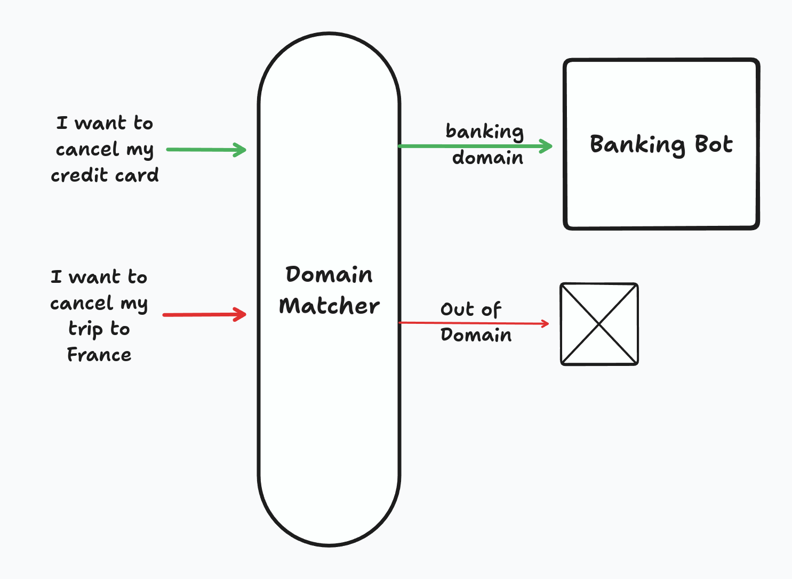
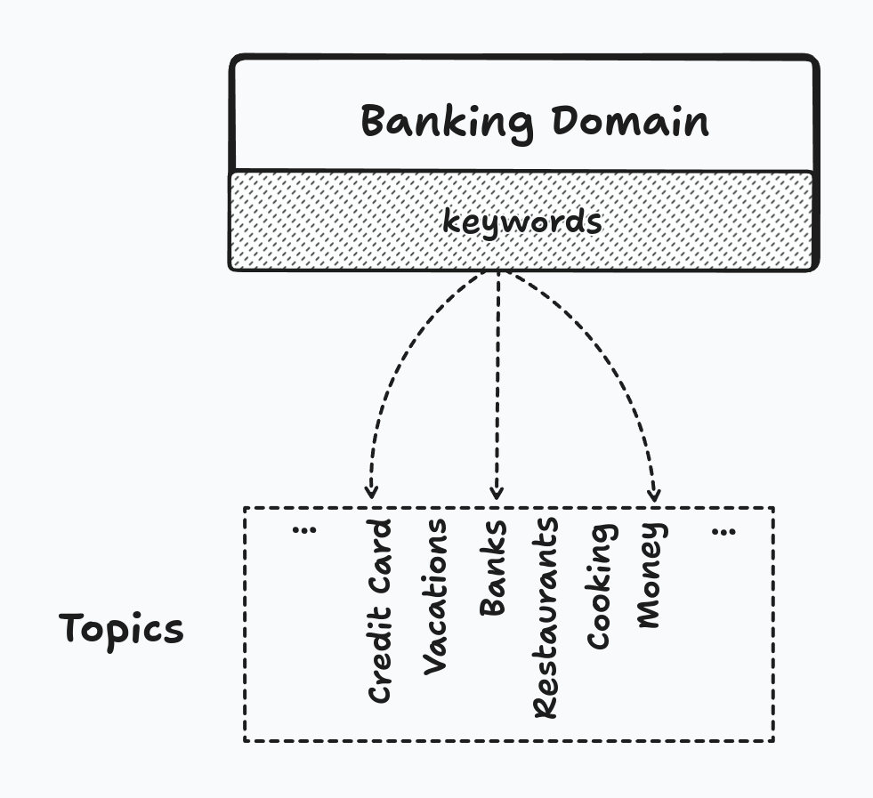

# Domain Matching to filter out-of-distribution observations

More than ever, protecting models from out-of-distribution samples is of tremendous importance.

While your model can accurately predict in-domain data, users will often throw out-of-distribution data at it. It only takes a couple of wrong interactions to discourage users from using your service ever again.

Here's how domain matching can quickly and efficiently save you a lot of headaches.

|  |
|:--------------------------------------------------------------------:|
|                       Domain Matcher overview                        |

**References**

 To my knowledge, Kawahara et al.(1)  were the first to propose this idea. The main difference between our approaches is that Kawahara et al. train an SVM to detect "in-domain" topics whereas this implementation automatically finds topics based on similarity and is thus compatible with online topic modeling.

### Problem setting

You have an intent classificaiton model predicting $$f(x) \rightarrow y$$ where $$y\in\{y_0,...,y_N,oos\}$$. *oos* is the "out-of-scope" class meaning, that it is out of distribution.

We can imagine that the *oos* class has a lot of support in our dataset. Due to the nature of this class, we need a wide range of examples to accurately predict it.

For this example, let's imagine that our model is a Banking chatbot guiding users to the relevant resources. Users can ask about canceling their credit card, making a payment or asking for a loan.

Now, what happens if someone asks "I want to cancel my phone plan"? If this particular example wasn't in our dataset, our model might predict "cancel_credit_card" instead of the "oos" class.

### How we solve it?

Domain Matching works by using topic modeling and semantic embeddings. Using the excellent BERTopic (2) and Sentence Transformers (3), we can train a topic model on our training dataset. Then, we define our domains. In our case, we have a Banking domain made of keywords related to banking: credit card, loan, payment, money, etc.

Using our topic model, we assign topics to each keyword creating a mapping between topics and our domain.

|  |
|:----------------------------------------------------------------------------:|
|                     How topics get assigned to a domain                      |

At inference time, we assign a topic to the utterance. If the topic is part of our domains, we let the model predict, otherwise we return *oos* as shown below.

As you see, it is quite a simple technique that is not expensive and is easy to set up.

### Examples

I trained a topic model on Banking CLINC, a reduced version of CLINC-151 focusing on banking intents. In the table below, I show the intent, its predicted domain and the model's prediction.

| Snippet                                 | Domain     | Prediction       |
|-----------------------------------------|------------|------------------|
| Freeze my credit Card                   | Banking  ✅ | Damage Card    ✅ |
| I need a Christmas card for my children | OOS  ✅     | Replace Card ❌   |
| Upgrade my RuneScape account            | OOS  ✅     | Freeze Account ❌ |

By using Domain Matching, we were able to protect our model from oos examples without adding more examples to our dataset.

This solution is not foolproof and one should verify that the topics are matched correctly.

**Domain Matching at Glowstick**

We've used Domain Matching extensively at [Glowstick](https://glowstick.ai). Our goal was to detect sales opportunities from transcripts. If we have two chatbot companies, what matters to one can be useless to the other.

In order to deliver maximum value, we've created "Domains" for what our customers care about and would filter out *oos* items.

**Conclusion**

We've covered a simple, yet effective out-of-distribution detection approach, Domain Matching. By using great libraries like BERTopic and SBERT, we were able to reduce the number of out-of-scope utterances that could reach our model.

More work is yet to be done, the lack of complex datasets in the intent classification community is a much-needed improvments to showcase the benefits of these approaches.

### Resources

1. Kawahara et al. [Topic classification and verification modeling for out-of-domain utterance detection](https://www.isca-archive.org/interspeech_2004/kawahara04c_interspeech.html)
2. The most excellent [BERTopic](https://maartengr.github.io/BERTopic/) library
3. Now a staple in all my projects [Sentence Transformers](https://sbert.net/)
